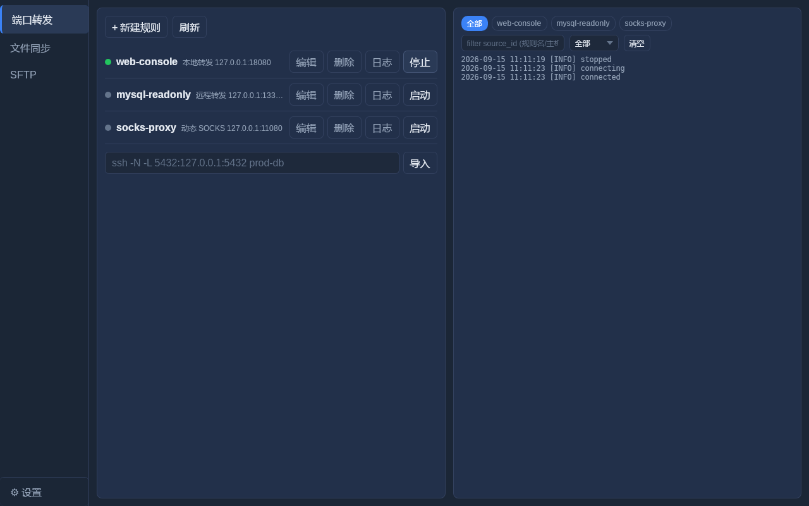
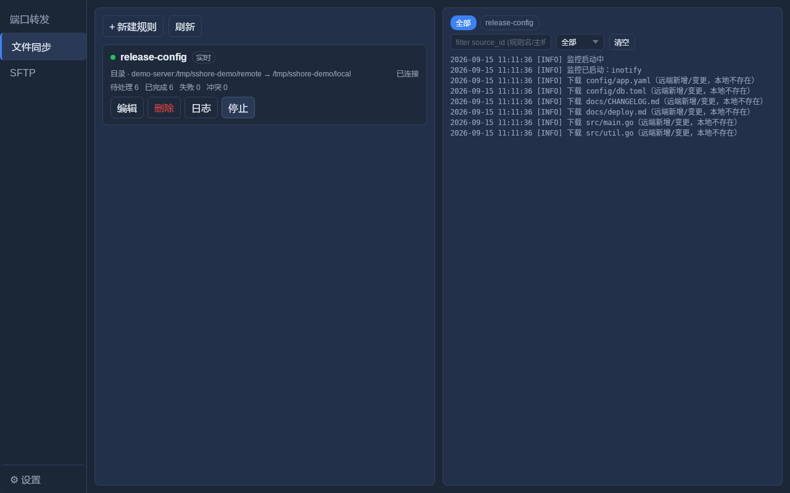
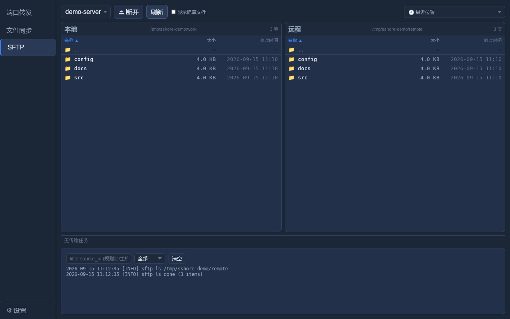
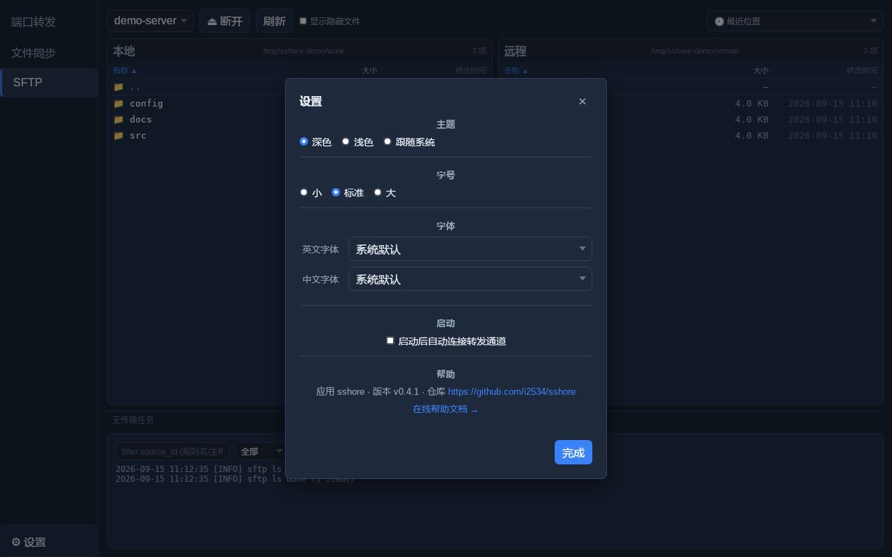

# sshore

**简体中文** | [English](README.en.md)

跨平台 SSH 端口转发 / 远程文件同步 / SFTP 管理工具。基于 Wails v2（Go）+ Vue 3 构建，
所有连接都复用系统自带的 OpenSSH。

## 界面预览

> 截图取自一次性本地 `sshd` + 演示数据，未使用真实主机。

| 端口转发 | 文件同步 |
| :---: | :---: |
|  |  |
| **SFTP** | **设置** |
|  |  |

## 环境要求

- Go 1.26
- Node.js 22+（LTS）
- 系统 `PATH` 中需有 OpenSSH（`ssh`、`sftp`）
- wails CLI（`go install github.com/wailsapp/wails/v2/cmd/wails@latest`）

## 下载安装

在 [GitHub Releases](https://github.com/i2534/sshore/releases) 下载对应平台的压缩包
（`sshore-<version>-linux-amd64.tar.gz` / `sshore-<version>-windows-amd64.zip`），
解压后直接运行 `sshore` 即可。

- 认证完全交给系统 OpenSSH（密钥 / ssh-agent / `~/.ssh/config`），应用本身不存储任何凭据。
- Linux 需要 webkit2gtk-4.1（Ubuntu/Debian：`libwebkit2gtk-4.1-0`）。
- Release 产物已用 UPX 压缩，运行时不依赖 UPX。

## 构建

```bash
make both     # 清理后同时构建 Linux 与 Windows 二进制（默认，尺寸优化）
make linux    # 仅 Linux amd64
make windows  # 仅 Windows amd64（打包：图标经 .syso 嵌入）
make build    # 当前平台
```

或直接使用 Wails CLI：

```bash
wails build
```

### 尺寸优化

`make` 目标会剥离符号/DWARF（`-ldflags "-s -w"`）、传递 `-trimpath`，
并默认用 UPX 压缩最终二进制（Linux ≈3.7 MB，Windows ≈4.5 MB）；
同时把 `git describe --tags` 得到的版本经 `-X main.Version=...` 注入，
供应用内「设置 → 帮助」显示。

- 设置 `COMPRESS=0` 可跳过 UPX（例如杀毒软件误报 UPX 打包的 Go 二进制，
  或你更看重启动速度）：`make both COMPRESS=0`
- 需要 `PATH` 中存在 UPX；若缺失，`wails build -upx` 会告警并跳过压缩
  （Wails 仅在安装 UPX 时才压缩）。
- 构建 Windows 时**不要**传 `-nopackage`：Wails 仅在启用打包（`Pack=true`）
  时生成带图标的 `.syso` 资源，`-nopackage` 会得到无图标的 exe。
  `make windows` 目标特意保留打包。

## 开发运行

```bash
wails dev
```

## 功能特性

- **SSH 端口转发**：本地 `-L`、远程 `-R`、动态 SOCKS `-D`、跳板机 `-J`
- **自动重连**：按规则开关。异常断开后按退避重试（日志显示
  `Ns 后第 N 次重连`），卡片状态如实进入「重连中 / 错误」，不会静默假装已连接
- **SFTP 文件管理**：双栏浏览 / 多选（Ctrl 点选、Shift 区间、Ctrl+A）/ 批量下载·上传·删除 /
  右键菜单 / 拖动投递（双栏互拖、从系统拖入、拖到子目录移动）/ 每面板的「最近位置」与即时过滤 /
  「显示隐藏文件」开关；传输队列表含方向、源到目标、跳过与失败原因
- **远程文件夹同步**：监控远端目录**或单个文件**，变化同步到本地；优先用
  `inotifywait`，不可用时自动降级为轮询（也可用 `force_poll` 强制轮询）；
  支持 `max_depth` 递归深度（`-1` 为不限）与排除项；默认不删除本地文件
  （镜像删除需显式开启，且仅对目录规则生效）；本地被改动时不覆盖，改为进入
  冲突队列由用户裁决（保留本地 / 用远端覆盖 / 另存远端版本）；批量删除会挂起
  等待二次确认；失败的传输可一键重试
- **设置**：深色 / 浅色 / 跟随系统主题，字号（小 / 标准 / 大），英文与中文字体
  栈，「启动后自动连接转发通道」，以及新建同步规则的默认自动重连值——全部
  持久化在 TOML 配置里
- **配置**：只读解析 `~/.ssh/config`（用于枚举主机）；隧道与同步规则保存在
  `~/.config/sshore/sshore.toml`（Windows 为 `%APPDATA%\sshore\sshore.toml`），
  以 0600 权限原子写入
- **命令导入**：将粘贴的 `ssh -L/-R/-D ...` 命令解析为规则
- **实时日志面板**：隧道 / SFTP / 同步事件的内存环形缓冲（1000 条）；
  可按规则单独切换过滤（规则卡片「日志」按钮 / 日志面板 chips），ssh 子进程的
  stderr 逐行采集进面板——隧道内部错误不再被吞掉
- **规则校验**：创建/编辑/导入时拒绝空目标主机（`-L 23080::3080` 这类
  坏规则会让 ssh 解析空主机名失败：连接即 RST 而进程不退出，界面误报
  connected）；本地/远程转发绑定失败时 `ExitOnForwardFailure` 使隧道
  直接进入 error 状态
- 认证使用系统 OpenSSH（密钥/agent/config），因此 GUI 不支持密码与
  keyboard-interactive 认证——请为你的主机配置密钥或 agent 认证

## 配置

`sshore.toml` 可以直接手改：缺失的键回落到默认值，显式的空/非法值
（主题、`font_scale`、`max_depth`、`poll_interval_s`、空排除列表）会在加载时
被规范化，不会静默改变行为。

```toml
[app]
  theme = "dark"                 # dark | light | system
  font_scale = 1.0               # 0.9 | 1.0 | 1.15
  auto_start_on_launch = false   # 启动后自动连接转发通道
  auto_reconnect_default = true  # 新建同步规则的默认自动重连值

[[tunnels]]                      # 端口转发规则（-L / -R / -D）
[[syncs]]                        # 远端 → 本地 的同步规则
[[recent_sftp]]                  # 最近使用过的 SFTP 主机与目录
```

## 架构

- `internal/config` — 解析 `~/.ssh/config`（枚举用 kevinburke/ssh_config，
  权威字段用 `ssh -G`）并读写原子化的 TOML 配置存储
- `internal/forward` — 生成/管理长驻 `ssh -N` 子进程、生命周期状态机、
  端口预检、错误分类、自动重连退避
- `internal/sftp` — 每次操作一个 `sftp -b` 进程，`ls -la` 输出解析
- `internal/sync` — 同步引擎：状态机、冲突队列、删除闸门、传输与路径映射
- `internal/watch` — 远端变更探测：`inotifywait` 探测 + 轮询降级
- `internal/sshconn` — ControlMaster socket 路径与 ssh/sftp 连接参数的唯一来源
- `internal/importer` — 将 `ssh -L/-R/-D` 命令行分词为规则（注入安全）
- `internal/osutil` — 跨平台进程执行、取消与信号处理
- `frontend/src` — Vue 3 UI（左侧导航模块切换：转发 / 文件同步 / SFTP）+ Pinia 存储

## 测试

```bash
go test ./...          # Go 子系统测试（mock ssh/sftp）
cd frontend && npx vitest run   # 前端单测（store、同步工具函数）
```

`make ci` 一条命令执行 CI 的全部内容（vet + `-race` Go 测试 + 前端测试）。

## E2E

```bash
make e2e    # 等价于：bash e2e/test_local.sh
```

`e2e/test_local.sh` 会启动一个临时本地 sshd，验证 sshore 依赖的 OpenSSH 行为：
`ssh -G` 别名解析、`-N -L` 本地转发绑定、`sftp ls -l` 输出解析。
需要 `/usr/sbin/sshd`、`ssh-keygen` 和 `python3`。

## CI

`.github/workflows/ci.yml` 在 push/PR 时运行以下作业：

- `go` — Ubuntu 上 `go vet` + `-race` Go 测试
- `go-windows` — 在真实 Windows runner 上跑同一套 vet/测试（覆盖 `osutil`
  的 Windows 分支、`%APPDATA%` 配置路径、Windows OpenSSH 的 `ls` 输出形状）
- `frontend` — `vitest run` + Vite 构建
- `build-linux` / `build-windows` — 分别构建 Linux（webkit2gtk-4.1）与
  Windows（图标经 `.syso` 嵌入）的 `wails build`，均含 UPX 压缩，并打包成
  带版本与平台名的压缩包
- `release` — 打 `v*` tag（或手动 workflow_dispatch 指定 `release_tag`）时
  把上述压缩包发布到 GitHub Release
